# DEVELOPERS.md — Local Development Setup

Step-by-step guide to spin up the full Labs64.IO stack on a local Kubernetes cluster, deploy all modules, and run regression tests.

## Prerequisites

Install these tools before starting:

| Tool | Version | Purpose |
|------|---------|---------|
| [Docker Desktop](https://www.docker.com/products/docker-desktop/) | latest | Container runtime |
| [k3d](https://k3d.io/) | v5.x+ | Local k3s (lightweight Kubernetes) |
| [Helm](https://helm.sh/) | v3.x+ | Kubernetes package manager |
| [Helmfile](https://helmfile.io/) | v1.x+ | Declarative multi-release orchestration (`just up`/`install-tools`/`install-all-apps`) |
| [kubectl](https://kubernetes.io/docs/tasks/tools/) | v1.28+ | Kubernetes CLI |
| [just](https://github.com/casey/just) | latest | Task runner (each repo has a justfile) |
| [curl](https://curl.se/) | latest | API testing |

Optional (for building images locally):
- Java 25 (Temurin) + Maven 3.6.3+ — for Java backends
- Node.js 22+ — for Vue frontends

## Architecture Overview

The diagram below outlines the local Kubernetes (`k3d`) setup for the Labs64.IO microservices ecosystem. It covers the configuration artifacts, third-party (3PP) infrastructure dependencies, and the proprietary Labs64 modules.

```mermaid
graph TB
    %% Definitions
    classDef config fill:#f9f2f4,stroke:#d3b8c6,stroke-width:2px,color:#333;
    classDef tools fill:#e6f3ff,stroke:#a6c8ff,stroke-width:2px,color:#333;
    classDef labs64 fill:#e6ffe6,stroke:#a6ffa6,stroke-width:2px,color:#333;
    classDef obs fill:#fff3e6,stroke:#ffd8a6,stroke-width:2px,color:#333;
    classDef host fill:#f0f0f0,stroke:#cccccc,stroke-width:2px,stroke-dasharray: 5, 5,color:#333;

    %% Host Environment
    subgraph Host["Local Host Machine"]
        registry["Docker Registry<br/>(localhost:5005)"]:::tools
        just["Just<br/>(Task Runner)"]:::tools
        
        subgraph Config["Configuration Artifacts"]
            dev_docs["DEVELOPERS.md<br/>(Setup Guide)"]:::config
            k3d_yaml["k3d/labs64io.yaml<br/>(Cluster Config)"]:::config
            helm_charts["labs64.io-helm-charts/*<br/>(Chart.yaml, values.yaml)"]:::config
        end
    end

    %% Kubernetes Cluster
    subgraph k3d_cluster["k3d Local Cluster (labs64io)"]
        
        %% Tools Namespace
        subgraph ns_tools["Namespace: tools (3rd Party Infrastructure)"]
            traefik["Traefik v3<br/>(Ingress Controller)"]:::tools
            rabbitmq["RabbitMQ<br/>(Message Broker)"]:::tools
            postgres["PostgreSQL<br/>(Database)"]:::tools
            redis["Redis<br/>(Cache)"]:::tools
            mock_oidc["Mock OIDC Provider<br/>(DEV only)"]:::tools
            
            subgraph Observability["Observability Stack (optional)"]
                otel["OpenTelemetry<br/>Collector"]:::obs
                tempo["Tempo<br/>(Traces)"]:::obs
                vlogs["Loki<br/>(Logs)"]:::obs
                prom["Prometheus<br/>(Metrics)"]:::obs
                grafana["Grafana<br/>(Dashboards)"]:::obs
            end
        end

        %% Labs64io Namespace
        subgraph ns_labs64io["Namespace: labs64io (Labs64 Modules)"]
            
            subgraph Gateway["Gateway & Auth"]
                api_docs["api-docs<br/>(Swagger UI)"]:::labs64
                authproxy["api-gateway<br/>(AuthProxy + Middlewares)"]:::labs64
            end
            
            subgraph AuditFlow["AuditFlow"]
                audit_be["auditflow-be"]:::labs64
                audit_transformer["auditflow-transformer"]:::labs64
                audit_sink["auditflow-sink"]:::labs64
            end
            
            subgraph Checkout["Checkout"]
                checkout_fe["checkout ui.enabled<br/>(Vue)"]:::labs64
                checkout_be["checkout-be<br/>(Java)"]:::labs64
            end
            
            subgraph PaymentGateway["Payment Gateway"]
                pg_be["payment-gateway-be<br/>(Java)"]:::labs64
            end
            
            subgraph CustomerPortal["Customer Portal"]
                cp_fe["customer-portal ui.enabled<br/>(Vue)"]:::labs64
            end
        end
    end

    %% Build & Config Flow
    just -->|Reads| dev_docs
    just -->|Applies| k3d_yaml
    just -->|Runs `helm upgrade`| helm_charts
    k3d_yaml -->|Bootstraps| k3d_cluster
    
    helm_charts -->|Deploys Resources to| ns_tools
    helm_charts -->|Deploys Resources to| ns_labs64io
    registry -->|Pulls Images| ns_labs64io

    %% User Ingress Flow
    User((Developer)) -->|HTTP 80/443| traefik
    traefik -.->|"ForwardAuth call (api-gateway auth middleware)"| authproxy
    authproxy -->|Validates JWT against| mock_oidc
    traefik -->|"Routes via Gateway API HTTPRoute (native filters + api-gateway middlewares via ExtensionRef)"| api_docs
    traefik --> audit_be
    traefik --> checkout_be
    traefik --> pg_be
    traefik --> checkout_fe
    traefik --> cp_fe
    
    %% Internal Dependencies
    checkout_be -->|Persists Data| postgres
    checkout_be -->|Publishes Events| rabbitmq
    
    pg_be -->|Persists Data| postgres
    pg_be -->|Idempotency| redis
    pg_be -->|Publishes Events| rabbitmq
    
    audit_be -->|Publishes Audits| rabbitmq
    rabbitmq -->|Consumes| audit_be
    audit_be -->|"Transform (HTTP, per pipeline)"| audit_transformer
    audit_be -->|"Sink (HTTP, per pipeline)"| audit_sink
    audit_be -->|Idempotency| redis
    
    %% Telemetry
    ns_labs64io -.->|OTLP Logs/Traces| otel
    otel -.-> tempo
    otel -.-> vlogs
    prom -.->|Scrapes| ns_labs64io
```



> **Observability model:** instrumentation is infrastructure-owned and injected at runtime — the
> same images run with it on or off, toggled by `observability.enabled`. See
> [OBSERVABILITY.md](OBSERVABILITY.md) for the full concept, signal flow, and env-variable contract.

### Key Configuration Artifacts

- **`k3d/labs64io.yaml`**: The cluster definition file. Bootstraps the lightweight Kubernetes cluster and local Docker registry mappings.
- **`labs64.io-helm-charts/`**: Contains the Kubernetes definitions for all services:
  - `Chart.yaml`: Helm chart metadata and dependency definitions.
  - `values.yaml` / `values.schema.json`: Configuration overrides and input validation schemas for local and deployed environments.

### Namespaces & Infrastructure

1. **`tools` Namespace**: Holds all external dependencies (3PP tools). Relies on third-party Helm repositories like Bitnami (RabbitMQ, Postgres, Redis) and Traefik.
2. **`labs64io` Namespace**: Where all proprietary Labs64 domains execute. All services route internal traffic through the common gateways.

### Request Flow

Traefik receives external requests mapping on ports 80/443 and routes them via Kubernetes Gateway API `HTTPRoute`s (module-owned, attached to the platform `Gateway` `labs64io-gateway` in `tools`). Each protected route strips inbound `X-Auth-*` headers first (native `RequestHeaderModifier`), then calls the `api-gateway` ForwardAuth middleware via an `ExtensionRef` filter. The proxy validates the `Authorization: Bearer` against the `Mock OIDC Provider` (generating fake JWT tokens for local environments). Validated requests pass through the remaining `api-gateway` middlewares (rate-limit, compress) before hitting the downstream microservices.

## Building module images

All Labs64.IO modules must be built as Docker images and pushed to the local registry (`localhost:5005`) before deploying to the k3d cluster. The Helm charts reference `localhost:5005/<module>:latest` for local development.

### Build all images

Before building images, you must ensure the local Docker registry (`localhost:5005`) is running. It is created automatically when you create the k3d cluster.

```bash
# 1. Create the cluster (and registry)
k3d cluster create --config k3d/labs64io.yaml

# 2. Build and push all images
# From the workspace root (one level up from labs64.io-helm-charts/) — this recipe
# lives in the top-level justfile, not this repo's, and builds every sibling module
# repo via scripts/build-images.sh in a containerized builder.
cd .. && just build
```

### Build individually

```bash
# Java backends (require Maven build first)
cd ../labs64.io-auditflow && mvn -B clean package -DskipTests --file auditflow-be/pom.xml
docker build -t localhost:5005/auditflow:latest -f auditflow-be/Dockerfile auditflow-be/
docker build -t localhost:5005/auditflow-transformer:latest -f auditflow-transformer/Dockerfile auditflow-transformer/
docker build -t localhost:5005/auditflow-sink:latest -f auditflow-sink/Dockerfile auditflow-sink/
docker push localhost:5005/auditflow:latest
docker push localhost:5005/auditflow-transformer:latest
docker push localhost:5005/auditflow-sink:latest

cd ../labs64.io-checkout && mvn -B clean package -DskipTests --file checkout-be/pom.xml
docker build -t localhost:5005/checkout:latest -f checkout-be/Dockerfile checkout-be/
docker build -t localhost:5005/checkout-ui:latest -f checkout-fe/Dockerfile checkout-fe/
docker push localhost:5005/checkout:latest
docker push localhost:5005/checkout-ui:latest

cd ../labs64.io-payment-gateway && mvn -B clean package -DskipTests --file payment-gateway-be/pom.xml
docker build -t localhost:5005/payment-gateway:latest -f payment-gateway-be/Dockerfile payment-gateway-be/
docker push localhost:5005/payment-gateway:latest

# Python services
cd ../labs64.io-authproxy
docker build -t localhost:5005/traefik-authproxy:latest -f traefik-authproxy/Dockerfile traefik-authproxy/
docker push localhost:5005/traefik-authproxy:latest

# Vue frontends
cd ../labs64.io-customer-portal
docker build -t localhost:5005/customer-portal-ui:latest -f customer-portal-fe/Dockerfile customer-portal-fe/
docker push localhost:5005/customer-portal-ui:latest
```

### Verify images in registry

```bash
curl -s http://localhost:5005/v2/_catalog
# Should list: auditflow, auditflow-transformer, auditflow-sink, checkout, checkout-ui, payment-gateway, traefik-authproxy, customer-portal-ui
```

## Quick start (one command)

From `labs64.io-helm-charts/`:

```bash
just up
```

This creates a k3d cluster, installs Traefik, the mock OIDC provider, all necessary infrastructure (RabbitMQ, PostgreSQL, Redis), and deploys all Labs64.IO modules. Takes ~5-10 minutes depending on your internet speed.

**Important:** Before running `just up`, you must create the cluster and push all module images to the local registry.
```bash
k3d cluster create --config k3d/labs64io.yaml
(cd .. && just build)   # workspace-root recipe — see "Building module images" above
just up
```

When it finishes:

```
Local environment ready: http://gateway.localhost/swagger-ui/
```

## Step-by-step setup

If you prefer to understand each step, or need to customize the setup:

### 1. Create the k3d cluster

```bash
# Create cluster with local registry (localhost:5005) and port mappings (80, 443)
k3d cluster create --config k3d/labs64io.yaml
```

This creates:
- A single-node k3s cluster named `labs64io`
- A local Docker registry on `localhost:5005`
- Port mappings: `80:80` and `443:443` on the loadbalancer
- k3s's built-in Traefik is disabled (we install our own)

Verify:
```bash
kubectl get nodes
# NAME                        STATUS   ROLES                  AGE   VERSION
# k3d-labs64io-server-0       Ready    control-plane,master   30s   v1.28.x+k3s1
```

### 2. Add Helm repositories

```bash
just repo-add
just repo-update
```

This adds repositories for: traefik, bitnami (RabbitMQ, PostgreSQL, Redis), open-telemetry, grafana, prometheus-community, metrics-server.

### 3-5. Install core tools (Traefik, ESO, RabbitMQ, PostgreSQL, Redis, mock OIDC)

All infra tools are declared as [Helmfile](https://helmfile.io/) releases (`helmfile.yaml.gotmpl`,
`layer: infra`) and installed together:

```bash
just install-tools
```

This installs the Gateway API + Traefik CRDs (`just install-crds`, run first since Helmfile
has no per-release CRD-skip equivalent), then via Helmfile: Traefik v3, [External Secrets
Operator](https://external-secrets.io/) (ESO), RabbitMQ, PostgreSQL, and Redis — then applies
the Traefik dashboard HTTPRoute, the mock OIDC provider, and the local `ClusterSecretStore`
(`overrides/eso/cluster-secret-store.yaml`) that lets any chart opt into ESO-backed secrets via
`externalSecrets.enabled` (see [Unified secret management](#unified-secret-management) below).

To install/inspect a single tool, use its own recipe, e.g. `just install-tool-traefik`,
`just install-tool-rabbitmq`, `just install-tool-postgresql`, `just install-tool-redis`,
`just install-tool-mock-oidc` — or target just that Helmfile release/layer directly:
```bash
helmfile -e local -l name=rabbitmq apply
```

Wait for all pods:
```bash
kubectl get pods -n tools
```

### 6. Build and Install Labs64.IO modules

**Build images (Required if not available in localhost:5005):**
```bash
(cd .. && just build)   # workspace-root recipe — see "Building module images" above
```

### Unified secret management

Every chart with a `secret.yaml` supports two mutually-exclusive modes, toggled by
`externalSecrets.enabled`:

- **`false` (default, Local Development / BYO Infra):** a plain `Secret` rendered from `.Values.secrets.data` only
  — infrastructure is decoupled from every application chart, so there is no bundled-dep
  credential fallback; broker/database credentials must always be supplied explicitly.
  Populated locally via `values.secrets.local.yaml`
  (below) — never committed.
- **`true` (opt-in locally, intended default for AWS QA / Staging / Prod Environment):** an `ExternalSecret`
  (`chart-libs.externalsecret`) that ESO resolves against a `ClusterSecretStore` — the
  same object shape in every environment, only the backing store differs. Locally that
  store is the `kubernetes`-provider `local-kubernetes-store` (installed by
  `just install-tools`), which replicates a same-named Secret out of the `tools`
  namespace; the AWS QA environment points `externalSecrets.storeName` at a
  ClusterSecretStore backed by AWS Secrets Manager. See `overrides/<app>/values.prod-example.yaml`
  for a documented example per app.

**Local secrets (default mode):** before installing the modules, make sure you have the
required secrets configured. Auto-generate the default local secrets from their `.example`
templates by running:
```bash
just generate-secrets
```
This is done automatically when you run `just up`. These files are ignored by git but injected during the local helm upgrade (and, since Helmfile adoption, by the matching `helmfile.yaml.gotmpl` release's conditional `values.secrets.local.yaml` entry).

**Install all at once:**
```bash
# This will start everything locally
just up
```

**Or one at a time:**
```bash
just install-app authz-pdp           # Cerbos PDP (required first)
just install-app api-gateway         # auth proxy + shared Traefik middlewares
just install-app api-docs            # Swagger UI
just install-app auditflow           # audit logging
just install-app checkout            # checkout backend + UI (ui.enabled)
just install-app payment-gateway     # payment gateway
just install-app customer-portal      # customer portal UI (no backend yet)
```

Verify all pods:
```bash
kubectl get pods -n labs64io
```

### 7. Verify the deployment

**Check Swagger UI:**
```
http://gateway.localhost/swagger-ui/
```

You should see API docs for: AuditFlow, Checkout, Payment Gateway, Customer Portal.

**Check Traefik dashboard:**
```
http://dashboard.localhost/dashboard/
```

## Generating JWT tokens for testing

All API calls to protected endpoints require a Bearer token. Use the mock OIDC provider:

```bash
# Generate a token with admin scope
just generate-jwt admin

# Generate a token with specific scope
just generate-jwt ecommerce
```

Use the returned `access_token` in API calls:
```bash
TOKEN=$(just generate-jwt admin | python3 -c 'import sys,json; print(json.load(sys.stdin)["access_token"])')

curl -H "Authorization: Bearer $TOKEN" \
  http://gateway.localhost/auditflow/api/v1/audit/publish \
  -H "Content-Type: application/json" \
  -d '{"source": "test", "event": "test.event"}'
```

## Regression tests

### End-to-end auth smoke test

Authentication through the full Traefik → auth-proxy → upstream path is covered by the
Robot Framework suite in `labs64.io-tests` (`tests/auditflow/authz.robot`):

```bash
cd labs64.io-tests
robot --include auditflow tests/auditflow/authz.robot
```

This asserts the full scope matrix (no token, malformed token, wrong scope, no scope, correct
scope, multiple scopes) against the live gateway edge, and — when the active kubectl context is
the local k3d dev cluster — additionally corroborates each decision against the authproxy's
authz decision log and AuditFlow's delivery log (`local-k8s-only` tagged cases; see
`labs64.io-tests/AGENTS.md` "Local-only pod-log corroboration").

### Helm tests

Run Helm tests for each module:

```bash
helm test labs64io-auditflow -n labs64io
helm test labs64io-checkout -n labs64io
helm test labs64io-payment-gateway -n labs64io
```

### API smoke tests

**AuditFlow — publish an audit event:**
```bash
TOKEN=$(just generate-jwt admin | python3 -c 'import sys,json; print(json.load(sys.stdin)["access_token"])')

curl -s -X POST http://gateway.localhost/auditflow/api/v1/audit/publish \
  -H "Authorization: Bearer $TOKEN" \
  -H "Content-Type: application/json" \
  -H "X-Correlation-ID: test-$(date +%s)" \
  -d '{
    "sourceSystem": "regression-test",
    "eventType": "test.user.created",
    "timestamp": "'$(date -u +%Y-%m-%dT%H:%M:%SZ)'",
    "data": {"userId": "test-123", "action": "create"}
  }' | python3 -m json.tool
```

**Checkout — list customers (expects empty list or existing data):**
```bash
TOKEN=$(just generate-jwt ecommerce | python3 -c 'import sys,json; print(json.load(sys.stdin)["access_token"])')

curl -s http://gateway.localhost/checkout/api/v1/customers \
  -H "Authorization: Bearer $TOKEN" | python3 -m json.tool
```

**Payment Gateway — list payment providers:**
```bash
TOKEN=$(just generate-jwt ecommerce | python3 -c 'import sys,json; print(json.load(sys.stdin)["access_token"])')

curl -s http://gateway.localhost/payment-gateway/api/v1/payment-providers \
  -H "Authorization: Bearer $TOKEN" | python3 -m json.tool
```

### Check observability (if installed with `just up-full`)

```bash
# Grafana
kubectl port-forward -n monitoring svc/grafana 3000:80
# Open http://localhost:3000 (admin/admin — get password from secret)

# Prometheus
kubectl port-forward -n monitoring svc/prometheus-kube-prometheus-prometheus 9090:9090
# Open http://localhost:9090

# Check logs in Loki (via Grafana → Explore → Loki)
```

## Common operations

### View logs

```bash
# All modules
just show-errors

# Specific module
kubectl logs -n labs64io -l app.kubernetes.io/name=checkout --tail=100
kubectl logs -n labs64io -l app.kubernetes.io/name=payment-gateway --tail=100
kubectl logs -n labs64io -l app.kubernetes.io/name=api-gateway --tail=100
```

### Reinstall a single module

```bash
just install-app checkout     # re-runs helm upgrade --install
```

### Uninstall everything

```bash
just uninstall-all-apps
just uninstall-tool-traefik
just uninstall-tool-rabbitmq
just uninstall-tool-postgresql
just uninstall-tool-redis
just uninstall-tool-mock-oidc
just cluster-down             # delete the k3d cluster
```

## Local development with hot reload

For active development with file watching, build and run services directly instead of via Helm:

### Backend (Java services)

```bash
# Checkout backend
cd ../labs64.io-checkout/checkout-be
just dev-up       # build JAR + docker compose up (PostgreSQL + RabbitMQ)
just dev-watch    # auto-restart on code changes
just dev-down     # stop

# Payment Gateway backend
cd ../labs64.io-payment-gateway/payment-gateway-be
just infra-up     # start infrastructure
just run          # build + spring-boot:run (local profile)
```

### Frontend (Vue apps)

```bash
# Checkout frontend
cd ../labs64.io-checkout/checkout-fe
npm install
npm run dev       # Vite dev server on :5173

# Customer Portal frontend
cd ../labs64.io-customer-portal/customer-portal-fe
npm install
npm run dev       # Vite dev server on :5173
```

### Python services (AuditFlow)

```bash
cd ../labs64.io-auditflow
just up            # full stack with docker compose
just up obs        # + observability (OTel, Tempo, Loki, Grafana)
```

## Troubleshooting

### Pods stuck in CrashLoopBackOff

```bash
kubectl describe pod <pod-name> -n labs64io
kubectl logs <pod-name> -n labs64io --previous
```

Common causes:
- Missing secrets (check `kubectl get secrets -n labs64io`)
- Database not ready (check `kubectl get pods -n tools -l app.kubernetes.io/name=postgresql`)
- RabbitMQ not ready (check `kubectl get pods -n tools -l app.kubernetes.io/name=rabbitmq`)

### 404 from gateway.localhost

- Check Traefik is running: `kubectl get pods -n tools -l app.kubernetes.io/name=traefik`
- Check HTTPRoutes are accepted: `kubectl get httproute -n labs64io` (details: `kubectl describe httproute <name> -n labs64io`)
- Check the platform Gateway is programmed: `kubectl get gateway -n tools labs64io-gateway`
- Check auth-proxy is running: `kubectl get pods -n labs64io -l app.kubernetes.io/name=api-gateway`

### 401/403 on API calls

- Verify token: `just generate-jwt admin`
- Check the central PDP: `kubectl get deploy,svc -n labs64io -l app.kubernetes.io/name=authz-pdp` and `kubectl exec -n labs64io deploy/labs64io-authz-pdp -- /cerbos healthcheck --kind=grpc` (— the authproxy loads a generated routes manifest and asks Cerbos; there is no `/.well-known/auth-policy` discovery anymore) plus `kubectl exec -n labs64io deploy/gateway-common -- wget -qO- http://localhost:8081/health/ready`
- Check static UI policies: `kubectl get configmap -n labs64io -l app.kubernetes.io/name=api-gateway -o yaml` (renders `static_policies.yaml` from `staticPolicies`)
- Check auth-proxy logs: `kubectl logs -n labs64io -l app.kubernetes.io/name=api-gateway`

### RabbitMQ connection refused

- Check RabbitMQ is running: `kubectl get pods -n tools -l app=rabbitmq`
- Verify credentials match chart defaults (username: `labs64`, password: `labs64pw`)
- Check service secrets: `kubectl get secret -n labs64io`

### Port 80/443 already in use

Stop other web servers (Apache, nginx, etc.) or change the port mapping in `k3d/labs64io.yaml`.

### Cluster creation fails

```bash
k3d cluster delete labs64io    # clean up partial creation
just up                        # retry
```
