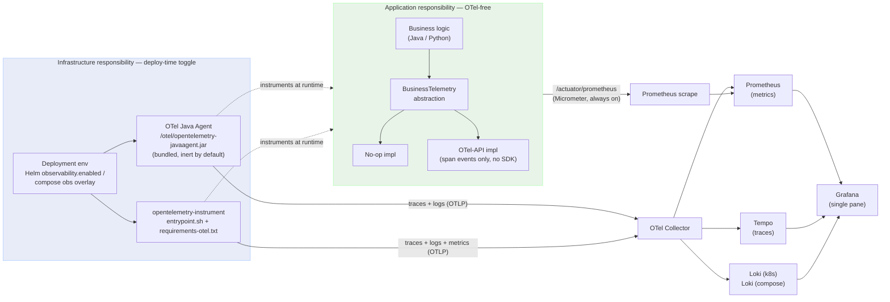
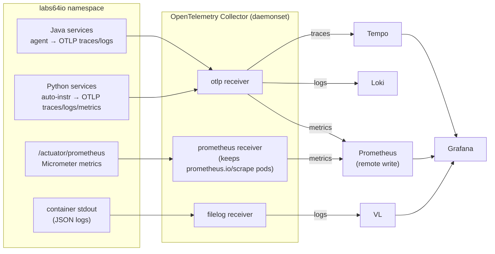

<p align="center"></p>

# Observability — Labs64.IO Ecosystem

> **The concept in one sentence:** observability is **infrastructure-owned**, not
> application-owned. Application code carries no OpenTelemetry SDK; instrumentation is
> injected at **runtime** by the platform and toggled purely by **deployment configuration**,
> so the *same image* runs identically with observability on or off.

This document is the canonical description of the observability model for **every** module in
the Labs64.IO Ecosystem (Java/Spring Boot, Python/FastAPI, Vue).

---

## 1. Why this model

Wiring an OpenTelemetry SDK into each service (Spring Boot starters, manual `tracing.py`
bootstraps) couples business code to a telemetry vendor at **compile time**: every service
carries SDK dependencies, every observability change is a code change and a rebuild, and
"turning it off" is impossible without shipping a different artifact.

The Labs64.IO model inverts this. Instrumentation is a property of *how a container is run*,
not of *what the container contains*:

| Principle | Consequence |
|---|---|
| **Application code is OTel-free** | No SDK/starter dependencies; no `import opentelemetry` in app code. |
| **Runtime auto-instrumentation** | The OTel Java Agent / `opentelemetry-instrument` add tracing, log correlation, and runtime metrics from *outside* the app. |
| **Deploy-time toggle** | One flag (`observability.enabled` in Helm; the obs compose overlay) turns everything on. |
| **Same image, both modes** | Enabling observability never requires a rebuild — only env changes. |
| **Metrics stay on Micrometer** | Java app/business metrics are scraped from `/actuator/prometheus`, so dashboard metric names never change. |
| **Business events go through a thin abstraction** | Domain signals auto-instrumentation cannot derive flow through `BusinessTelemetry`, which is a no-op unless the agent is attached. |

---

## 2. The two-plane model

Responsibility splits cleanly into an **application plane** (OTel-free, what we build) and an
**infrastructure plane** (deploy-time, what the platform injects).



**Application plane** — every service depends only on its own `BusinessTelemetry` interface.
The OTel-backed implementation uses `opentelemetry-api` **only** (never the SDK); without the
agent attached that API is a built-in no-op, so the same code is safe in plain local dev.

**Infrastructure plane** — the agent / auto-instrumentation instrument the running process from
the outside and are activated entirely by environment variables the deployment sets.

---

## 3. How instrumentation is injected

### Java services (Spring Boot)

The OTel Java Agent (`2.29.0`) is **bundled into every service image** at
`/otel/opentelemetry-javaagent.jar` (via a `Dockerfile` `ADD` from the upstream release). It is
**inert** until the deployment sets:

```
JAVA_TOOL_OPTIONS=-javaagent:/otel/opentelemetry-javaagent.jar
```

When attached, the agent auto-instruments HTTP (server + `WebClient`), AMQP, JDBC, and JVM
runtime, bridges Logback MDC (`trace_id` / `span_id`), and exports **traces + logs** over OTLP.
It does **not** export metrics — see §5.

> Chosen over the OTel Operator's admission-webhook injection because the agent is one mechanism
> that works identically in Docker Compose **and** Kubernetes, needs no init container or webhook,
> and pins the version per image.

### Python services (FastAPI)

OTel packages live in an **infrastructure-owned** `requirements-otel.txt` (installed by the
`Dockerfile`, never imported by app code). An `entrypoint.sh` wrapper starts the process under
auto-instrumentation **only when an OTLP endpoint is present**:

```sh
if [ -n "${OTEL_EXPORTER_OTLP_ENDPOINT}" ]; then
    exec opentelemetry-instrument "$@"
fi
exec "$@"
```

Python auto-instrumentation exports **traces + logs + metrics** over OTLP.

### Vue / frontend

Browser modules emit no server-side telemetry; they are observed through the gateway and the
backend spans their requests trigger.

---

## 4. The toggle

Observability is **off by default** everywhere. It is enabled by a single switch per
environment — never by editing application code:

| Environment | Switch | Effect |
|---|---|---|
| **Kubernetes (Helm)** | `observability.enabled: true` (per module chart) | Injects `JAVA_TOOL_OPTIONS` + `OTEL_*` env into the backend, `OTEL_*` into Python sidecars, and adds `prometheus.io/scrape` pod annotations. |
| **Docker Compose (local)** | the obs overlay (`just up obs` in a module repo) | Same env-only activation against a compose-local collector. |
| **Plain local dev** | *(nothing)* | No agent, no exporters — no connection-refused spam; `BusinessTelemetry` degrades to no-op. |

The activation contract is cross-language and cross-environment:

> **Observability is ON ⇔ the deployment sets `OTEL_EXPORTER_OTLP_ENDPOINT`**
> (plus `JAVA_TOOL_OPTIONS` for Java).

### Environment variable contract

| Variable | Java (backend) | Python (transformer/sink) | Purpose |
|---|---|---|---|
| `JAVA_TOOL_OPTIONS` | `-javaagent:/otel/opentelemetry-javaagent.jar` | — | Attaches the Java Agent |
| `OTEL_EXPORTER_OTLP_ENDPOINT` | collector URL | collector URL *(also the Python on/off trigger)* | OTLP target |
| `OTEL_EXPORTER_OTLP_PROTOCOL` | `http/protobuf` | `http/protobuf` | OTLP encoding |
| `OTEL_SERVICE_NAME` | service name | service name | `service.name` resource attr |
| `OTEL_METRICS_EXPORTER` | `none` | `otlp` | Java metrics via scrape, not OTLP (§5) |
| `OTEL_LOGS_EXPORTER` | *(agent default)* | `otlp` | Log export |
| `OTEL_PYTHON_LOG_CORRELATION` | — | `true` | Inject trace ids into logs |
| `OTEL_PYTHON_LOGGING_AUTO_INSTRUMENTATION_ENABLED` | — | `true` | Bridge Python logging → OTLP |

Sampling and other agent behavior are tuned with standard `OTEL_*` env
(`OTEL_TRACES_SAMPLER`, `OTEL_TRACES_SAMPLER_ARG`, …) on the deployment — never in code.

---

## 5. Metrics: Micrometer scrape is retained (deliberate)

Java **metrics deliberately do not flow through the agent** (`OTEL_METRICS_EXPORTER=none`).
They stay on **Micrometer → `/actuator/prometheus`**, scraped by Prometheus. This keeps every
existing Grafana query working unchanged — Micrometer is already a vendor-neutral abstraction
with a no-op mode, so metric names (`http_server_requests_seconds_*`, `jvm_*`,
`process_cpu_usage`, and business counters like `auditflow_pipeline_outcomes_total`) never
change when observability is toggled.

Python metrics *do* flow over OTLP (same path as its traces/logs) into Prometheus.

> **Trade-off:** trace-to-metric **exemplars** are not enabled by default (they would require
> agent OTLP metrics). Flip `OTEL_METRICS_EXPORTER=otlp` per deployment to opt in — at the cost
> of metric-name changes to OTel semantic conventions. Documented, not enabled.

---

## 6. Signal flow & backends (Kubernetes)

The OpenTelemetry **Collector** (contrib image, deployed as a daemonset) is the single ingest
point. Its pipelines (`overrides/opentelemetry/values-collector.local.yaml`):



| Signal | Producer | Collector pipeline | Backend |
|---|---|---|---|
| **Traces** | Java Agent, Python auto-instr | `otlp` → `otlp/tempo` | **Tempo** |
| **Logs** | Java Agent (OTLP), Python (OTLP), container stdout | `filelog + otlp` → `otlphttp/loki` | **Loki** (k8s) |
| **Metrics (Java)** | Micrometer `/actuator/prometheus` | `prometheus` receiver → `prometheusremotewrite` | **Prometheus** |
| **Metrics (Python)** | auto-instr (OTLP) | `otlp` → `prometheusremotewrite` | **Prometheus** |
| **Dashboards** | — | — | **Grafana** (Prometheus + Tempo + Loki datasources) |

> **Logs backend differs by environment:** Kubernetes uses **Loki**; the local Docker
> Compose observability overlay uses **Loki**. Both are queried through Grafana.

---

## 7. Business telemetry abstraction

Auto-instrumentation captures infrastructure signals (HTTP, AMQP, JDBC, JVM) for free. Only
**domain signals it cannot derive** are added explicitly — through a thin, per-service
`BusinessTelemetry` abstraction that business code depends on directly:

- **Java** — `io.labs64.<module>.telemetry.BusinessTelemetry` interface with an `OtelBusinessTelemetry`
  impl (span events via `opentelemetry-api` only) and a `NoopBusinessTelemetry` impl, selected by
  `labs64.telemetry.enabled` (default `true`). Without the agent the OTel-API impl is inherently a
  no-op, so the property is only an explicit kill switch.
- **Python** — `telemetry.py` exposing `get_business_telemetry()`, returning an OTel-backed impl when
  `opentelemetry` is importable and a no-op otherwise.

The abstraction is intentionally **minimal (YAGNI)** — e.g. AuditFlow records only
`auditEventReceived` / `pipelineCompleted` (Java) and `transformation_completed` /
`sink_completed` (Python). Business code **must never import OpenTelemetry APIs directly**; the
`opentelemetry-api` dependency is allowed *only inside the telemetry package/module*.

---

## 8. Applying this to a new module

The pattern is uniform across services. To make a module observable:

1. **Java:** bundle the agent in the `Dockerfile` (`ADD` the pinned release to `/otel/`); ensure
   the image carries **no** OTel SDK/starter deps; keep `micrometer-registry-prometheus` for the
   scrape.
2. **Python:** add `requirements-otel.txt` + `entrypoint.sh`; keep app `requirements.txt` OTel-free.
3. **(optional) Business telemetry:** add a `BusinessTelemetry`-style abstraction *only where
   domain events exist*.
4. **Chart:** wire `observability.enabled` / `observability.otlpEndpoint` values that inject the
   env from §4 and add `prometheus.io/scrape` annotations (copy the `auditflow` chart pattern).
5. **Verify both modes:** the same image must start cleanly with observability off (no exporter
   spam) and, with it on, produce a distributed trace, correlated logs, and scraped metrics.

---

## 9. Guardrails — what NOT to do

- ❌ **Never add** OpenTelemetry **SDK/starter** dependencies or SDK bootstrap code to a service.
  (`opentelemetry-api` is allowed only inside the telemetry abstraction.)
- ❌ **Never import** `opentelemetry` in application/business code.
- ❌ **Never** set `JAVA_TOOL_OPTIONS` for the agent via `.Values.env` when `observability.enabled`
  is true — the chart already injects it (double-attach breaks the JVM).
- ❌ **Never** switch Java metrics off Micrometer scrape casually — it changes dashboard metric
  names (see §5 for the exemplars trade-off).
- ✅ **Do** make observability changes in deployment config (Helm values, compose overlay,
  collector pipelines), and domain-signal changes through `BusinessTelemetry`.

---

## References

- **Collector pipelines** — `overrides/opentelemetry/values-collector.local.yaml`
- **Grafana / Tempo / Prometheus overrides** — `overrides/{grafana,tempo,prometheus}/values.local.yaml`
- **AuditFlow chart (reference wiring)** — `charts/auditflow/` (`observability.*` values, `templates/deployment.yaml`)
- **Local setup & architecture diagram** — [`DEVELOPERS.md`](./DEVELOPERS.md)
- Root ecosystem guidance — workspace `AGENTS.md` (guardrail: *observability is infrastructure-owned*)
