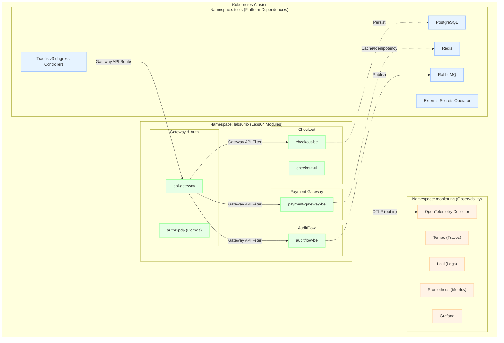
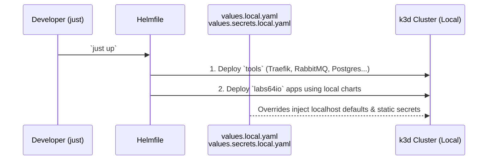
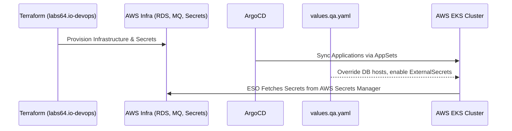

<p align="center"></p>

# Labs64.IO :: Helm Charts

[](https://artifacthub.io/packages/search?repo=labs64io-helm-charts)
[](https://github.com/Labs64/labs64.io-docs)

## High-Level Architecture Overview

The ecosystem separates resources logically into namespaces. Application workloads (the proprietary Labs64 microservices) reside in `labs64io`, while third-party (3PP) platform dependencies reside in `tools` or `monitoring`.



## Deployment Modes

The Helm charts adapt seamlessly from local environments to robust GitOps-managed clusters and arbitrary user-provided infrastructure. The configuration is isolated in environment overrides (`overrides/<app>/values.<env>.yaml`).

### 1. Local Development (Helmfile + k3d)

The local environment optimizes for speed and developer convenience.

- **Orchestration**: Managed by [Helmfile](https://helmfile.io/) and `just`.
- **Infrastructure**: Spun up locally on `k3d`. Helmfile applies Bitnami charts to the `tools` namespace.
- **Secrets**: `externalSecrets.enabled: false`. Developers populate local `values.secrets.local.yaml` files (git-ignored) which directly render plain Kubernetes `Secret` resources.



### 2. AWS QA / Staging / Prod Environment (ArgoCD + Terraform)

The internal QA and production environments are strictly GitOps driven. `Helmfile` is **not** used here. 

- **Orchestration**: Managed by **ArgoCD** configured in the `labs64.io-devops` repository.
- **Infrastructure**: Provisioned externally via **Terraform** (e.g., AWS RDS for Postgres, Amazon MQ for RabbitMQ, ElastiCache for Redis).
- **Secrets**: `externalSecrets.enabled: true`. Helm templates generate an `ExternalSecret` custom resource instead of a plain `Secret`. The **External Secrets Operator (ESO)** resolves this against a `ClusterSecretStore` backed by AWS Secrets Manager.



### 3. Users' Own Infrastructure (BYO Infra)

Users are expected to deploy to their own clusters (GCP, Azure, on-prem). 

- **Orchestration**: Helm CLI, ArgoCD, Flux, etc.
- **Infrastructure**: Provided by the user. The charts deliberately do not bundle PostgreSQL or RabbitMQ sub-charts to avoid lock-in.
- **Configuration**: Users reference `overrides/<module>/values.prod-example.yaml` to craft their own overrides.
- **Secrets**: Users can use `externalSecrets.enabled: false` to inject their own CI-managed secrets, or `externalSecrets.enabled: true` pointing to their own Vault/GCP Secret Manager `ClusterSecretStore`.

| Profile | File | Use case |
|---|---|---|
| standalone (bundled infra) | `charts/<module>/values.standalone.yaml` (checkout, payment-gateway, auditflow) | install the module alone, pointed at your own PostgreSQL/RabbitMQ/Redis |
| BYO overrides | `overrides/<module>/values.prod-example.yaml` | copy & adapt: your infrastructure, credentials via `secrets.data` (ESO recommended) |

Network policies also accept `networkPolicy.ingressControllerLabels` (pod-selector labels for a
non-Traefik ingress controller, e.g. `app.kubernetes.io/name: nginx`) and
`networkPolicy.observabilityNamespace` (default `monitoring`) when your cluster's naming differs
from the defaults.

### Capability requirements (bring-your-own infrastructure)

Modules need capabilities, not specific tools:

| Module | Needs |
|---|---|
| auditflow | AMQP 0-9-1 broker |
| checkout | AMQP 0-9-1 broker; PostgreSQL (db `checkout`, login with CREATE DATABASE for first install) |
| payment-gateway | AMQP 0-9-1 broker; PostgreSQL (db `payment_gateway`); Redis |
| gateway stack | any OIDC provider supporting client_credentials; scope/role claims are configurable via `TOKEN_SCOPES_CLAIM_PATHS` (default: `scope,realm_access.roles,resource_access.{audience}.roles`) |

Reference versions (the shared local toolset installed by `just install-tools` /
`helmfile.yaml.gotmpl`): RabbitMQ chart 16.0.14, PostgreSQL chart 18.7.11, Redis chart
27.0.13. For local development, images must be built and pushed to the local registry
(`localhost:5005`) — see DEVELOPERS.md.

### Preflight: verify your infrastructure first

    helm install preflight ./charts/preflight -n labs64io --create-namespace \
      -f my-endpoints.yaml
    kubectl wait --for=condition=complete job/preflight -n labs64io --timeout=120s \
      || kubectl logs job/preflight -n labs64io --all-containers

Each enabled check (broker TCP, PostgreSQL login, Redis PING, OIDC token grant)
runs as one container; the Job succeeds only if all pass.

### Local cluster

    just up               # k3d cluster + registry + all modules (Helmfile-driven)
    just up-full          # + monitoring stack, observability enabled
    just cluster-down     # delete the k3d cluster

## Usage

[Helm](https://helm.sh) must be installed to use the charts.  Please refer to Helm's [documentation](https://helm.sh/docs) to get started.

Once Helm is properly set up, add the repository as follows:
```
helm repo add <alias> https://labs64.github.io/labs64.io-helm-charts
```

If you have already added this repository, run the following command to retrieve the latest versions of the packages:
```
helm repo update
```

To list the available chart versions:
```
helm search repo <alias>
```

To view default chart values:
```
helm show values <alias>/<chart-name>
```

To install the <chart-name> chart:
```
helm upgrade --install my-<chart-name> <alias>/<chart-name>
```

To uninstall the chart:
```
helm uninstall my-<chart-name>
```

## Building-Box: cherry-pick your modules

Every module chart is standalone - install only what you need. Infrastructure
(RabbitMQ, PostgreSQL, Redis) is decoupled from every application chart — no chart
bundles them as a dependency. Point `applicationYaml` at whatever broker/database you
provide (the shared local toolset installed by `just install-tools`, or your own
infrastructure in a real environment); see [Capability requirements](#capability-requirements-bring-your-own-infrastructure)
below for what each module needs.

| Module | Purpose | Infra required (BYO) | Gateway routes (opt-in) | Install |
|---|---|---|---|---|
| auditflow | Audit logging | RabbitMQ | `/auditflow/api` (protected), `/auditflow/v3/api-docs` (public) | `helm install my-auditflow labs64io-pub/auditflow` |
| checkout | Checkout API + UI (`ui.enabled`) | RabbitMQ, PostgreSQL | `/checkout/api` (protected), `/checkout/v3/api-docs` (public), `/checkout` UI (public — static assets, no Bearer token on plain navigation) | `helm install my-checkout labs64io-pub/checkout` |
| payment-gateway | Payments API | RabbitMQ, PostgreSQL, Redis | `/payment-gateway/api` (protected), `/payment-gateway/v3/api-docs` (public) | `helm install my-payments labs64io-pub/payment-gateway` |
| customer-portal | Customer portal UI (no backend yet; `ui.enabled`) | - | `/customer-portal` (public — static assets, no Bearer token on plain navigation) | `helm install my-portal labs64io-pub/customer-portal` |
| api-gateway | ForwardAuth OIDC/JWT verifier + shared Traefik middlewares (auth, rate limit, headers) | - | n/a | `helm install api-gateway labs64io-pub/api-gateway` |
| authz-pdp | Cerbos PDP — central authorization decision point | - | n/a | `helm install authz-pdp labs64io-pub/authz-pdp` |
| api-docs | Swagger UI aggregator | - | `/swagger-ui` (public) | `helm install api-docs labs64io-pub/api-docs` |

Prefer Gateway API (`gateway.enabled: true`, Traefik v3 + Gateway API CRDs + the
`api-gateway` chart for ForwardAuth/shared middlewares) — it's the only path that enforces
ForwardAuth/Cerbos authorization and strips inbound `X-Auth-*` headers. If the cluster has no
Gateway API CRDs, every chart falls back to a plain `networking.k8s.io/v1` Ingress
(`gateway.annotations`, `gateway.ingressClassName` configure it) — but **only for routes marked
`public: true`**; a protected route (e.g. `/checkout/api`) has no Ingress equivalent for
ForwardAuth/Cerbos enforcement, so the chart fails the render rather than silently exposing it.
Install the Gateway API CRDs if you need protected routes on a cluster that lacks them.

### Gateway API setup

None of these charts create the Gateway API `Gateway` resource itself — every module's
`gateway.parentRefs` just points at one by name (`labs64io-gateway` in namespace `tools` by
default). That's intentional: the Gateway is infrastructure-owned and shared across every
module, the same way the database/broker are. The [Gateway API CRDs](https://gateway-api.sigs.k8s.io/guides/#installing-gateway-api)
and a `GatewayClass`/`Gateway` need to exist before any `gateway.enabled: true` route can
actually receive traffic — until they do, the HTTPRoute renders fine but sits at
`Accepted: False`.

The [Traefik chart](https://github.com/traefik/traefik-helm-chart) can provision both directly.
Minimal values to reproduce the setup every module's defaults expect:

```yaml
providers:
  kubernetesGateway:
    enabled: true

gatewayClass:
  enabled: true

gateway:
  enabled: true
  name: labs64io-gateway
  namespace: tools
  listeners:
    web:
      port: 8000
      protocol: HTTP
      namespacePolicy:
        from: All   # modules install into any namespace; the listener must accept routes from all of them
```

```
helm install traefik traefik/traefik -n tools --create-namespace -f traefik-values.yaml
```

Point your DNS/`/etc/hosts` (or an `Ingress`/`LoadBalancer` in front of Traefik) at that
Service, and every module's `gateway.parentRefs` will resolve without any further change.

Local testing: `just install-tool-mock-oidc` (dev-only M2M tokens),
`just install-app <module>`, `helm test labs64io-<module> -n labs64io`.

### One-click full stack (umbrella chart)

`labs64io-ecosystem` is an umbrella chart that installs every module plus optional bundled
PostgreSQL/RabbitMQ/Redis (`postgresql.enabled` / `rabbitmq.enabled` / `redis.enabled`, on by
default) with credentials pre-wired end-to-end via a shared `Secret`. Cherry-pick within it
with `--set <module>.enabled=false`:

```
helm install labs64io labs64io-pub/labs64io-ecosystem
```

Use the umbrella chart for a full local/demo stack; install individual module charts directly
(table above) to cherry-pick just what you need against your own infrastructure. It does not
bundle Traefik or a `Gateway` — see [Gateway API setup](#gateway-api-setup) above for that.

## Observability

Observability across the ecosystem is **infrastructure-owned**: services ship no OpenTelemetry
SDK, instrumentation is injected at runtime (OTel Java Agent / `opentelemetry-instrument`), and
the whole stack is toggled per deployment with `observability.enabled` — the same image runs with
it on or off. Signals flow through an OpenTelemetry Collector to Tempo (traces), Loki
(logs), and Prometheus (metrics), unified in Grafana.

See **[OBSERVABILITY.md](OBSERVABILITY.md)** for the full model, the env-variable contract, and
how to make a new module observable.

## Star History

[](https://www.star-history.com/#Labs64/labs64.io-helm-charts&Date)
